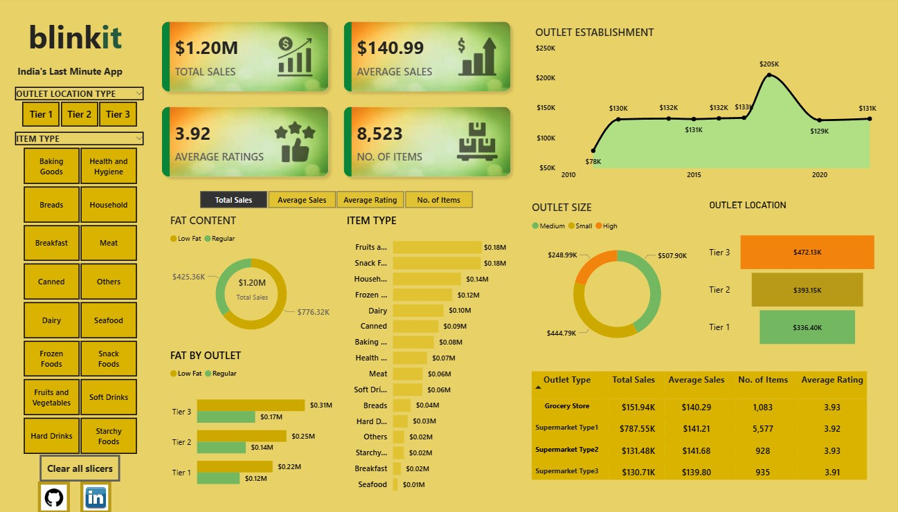

# Blinkit Sales Analytics Dashboard  

📊 **An interactive Power BI dashboard providing sales, outlet, and customer insights for Blinkit (India’s Last Minute App).**  

---

## 🚀 Project Overview  
This project presents an interactive **Power BI dashboard** analyzing sales, product categories, outlet performance, and customer ratings for **Blinkit**. It empowers stakeholders to make data-driven decisions by highlighting trends in sales, outlet size/location, and product demand.  

---

## 🎯 Objectives  
- Analyze **total and average sales** across outlets and product categories.  
- Track **customer ratings** and **number of items sold**.  
- Evaluate sales trends over **outlet establishment years**.  
- Compare performance by **outlet size** (Small, Medium, High) and **location type** (Tier 1, Tier 2, Tier 3).  
- Identify **high-performing product categories and outlets**.  

---

## 📊 Key Insights  
- 💰 **Total Sales**: `$1.20M` | **Average Sale Value**: `$140.99`  
- 🏙️ **Tier 3 outlets** generated the highest sales (`$472K`), followed by Tier 2 (`$393K`) and Tier 1 (`$336K`).  
- 🏪 **Supermarket Type 1** contributed the majority of sales (`$787K`).  
- 🥦 **Fruits & Vegetables** and 🍪 **Snack Foods** drove the largest revenue share.  
- 📈 Outlets established in **2018–2019** showed peak performance (`$205K`).  
- ⭐ Average customer rating: **3.92** across **8,523 items**.  

---

## 🛠️ Tools & Technologies  
- **Power BI** – Data visualization & dashboard design  
- **Excel** – Data cleaning & preprocessing  
- **Data Analytics** – Exploratory analysis & business insights  

---

## 📂 Dashboard Features  
✅ KPI cards: **Total Sales, Average Sales, Customer Ratings, No. of Items**  
✅ Donut charts: **Fat Content & Outlet Size breakdown**  
✅ Bar charts: **Item Type & Fat by Outlet analysis**  
✅ Line chart: **Outlet Establishment trends (year-wise)**  
✅ Location analysis: **Tier 1, Tier 2, Tier 3 outlets**  

---

## 📷 Dashboard Preview  
  

---

## 📌 Outcome  
The dashboard equips stakeholders with a **comprehensive view of Blinkit’s sales performance**, enabling data-driven strategies in:  
- 📍 Outlet expansion  
- 📦 Product category focus  
- 💡 Pricing & customer experience improvement  

---
